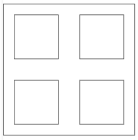
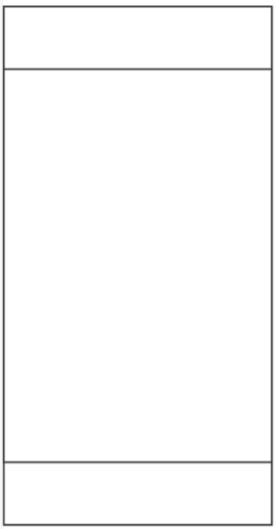

- 3. 给定两个数值，根据数值大小显示不同结果(x大于y、x小于y 或 x等于y)[(条件属性)](notes.md#条件属性)

    ```js
    data: {
        x:15,
        y:17
    },
    ```

    ```xml
    <view>
        <block wx:if="{{x>y}}">
            x大于y
        </block>
        <block wx:elif="{{x<y}}">
            x小于y
        </block>
        <block wx:else>
            x等于y
        </block>
    </view>
    ```

- 4. 已定义一个数组，遍历显示数组内容[(列表渲染)](notes.md#列表渲染)

    ```js
    data: {
        arr:[1,5,7,8,12,4,3]
    },
    ```

    显示效果：

        第1个数是：1
        第2个数是：5
        …………

    参考实现：

    ```xml
    <view>
        <block wx:for="{{arr}}">
            <view>第{{index+1}}个数是：{{item}}</view>
        </block>
    </view>
    ```

- 5. 使用弹性布局实现如下效果：
    

    ```xml
    <view class="outer">
        <view></view>
        <view></view>
        <view></view>
        <view></view>
    </view>
    ```

    ```css
    view{
        border: 1px solid #000;
    }
    .outer{
        width: 300px;
        height: 300px;
        display: flex;
        flex-wrap: wrap;
        justify-content: space-around;
        align-items: center;
    }
    .outer>view{
        width: 100px;
        height: 100px;
    }
    ```

- 6. 使用弹性布局实现如下效果(上方和下方容器高度均为80px，中间容器占据剩余所有空间，三个容器宽度和高度均占满整个界面)：

    

    ```xml
    <view class="outer">
        <view class="top"></view>
        <view class="center"></view>
        <view class="bottom"></view>
    </view>
    ```

    ```css
    page{
        height: 100%;
    }
    view{
        border: 1px solid #000;
    }
    .outer{
        width: 100%;
        height: 100%;
        display: flex;
        flex-direction: column;
    }
    .top{
        height: 80px;
    }
    .center{
        flex-grow: 1;
    }
    .bottom{
        height: 80px;
    }
    ```

- 7. 定义一个多项选择器组件，并将选择结果按特定格式显示在下方[(setData)](notes.md#setdata)
    ```js
    data: {
        foods:[]
    }

    getvalue1:function(e){
        this.setData({foods:e.detail.value})
    }
    ```

    ```xml
    <view>
        <checkbox-group bindchange="getvalue1">
            <checkbox value="鸡蛋">鸡蛋</checkbox>
            <checkbox value="油条">油条</checkbox>
            <checkbox value="饼子">饼子</checkbox>
        </checkbox-group>
    </view>

    <view>
        <view wx:for="{{foods}}">
            你的第{{index+1}}个选择是{{item}}
        </view>
    </view>
    ```

- 9. 在界面上添加一个文本域，并将输入内容显示在下方

    ```js
    data: {
        txt:""
    },

    showvalue2:function(e){
        this.setData({txt:e.detail.value})
    },
    ```

    ```xml
    <view>
        <input bindinput="showvalue2" type="text" placeholder="请在此输入内容"/>
    </view>
    <view>
        {{txt}}
    </view>
    ```

- 11. 定义一个滚动选择器，并将选择结果显示在下方(内容为对象数组时)

    ```js
    data: {
        pleyers:[{
            id:"01",
            name:"张三"
        },{
            id:"02",
            name:"李四"
        },{
            id:"03",
            name:"王五"
        }],
        i:0
    },
    showvalue:function(e){
        this.setData({i:e.detail.value})
    },
    ```

    ```xml
    <view>
        <picker range="{{pleyers}}" range-key="name" value={{i}} bindchange="showvalue">
            请选择你支持的选手
        </picker>
    </view>
    <view>
        你支持:{{pleyers[i].id}}号选手{{pleyers[i].name}}
    </view>
    ```

- 12. navigator 导航链接组件，其属性open-type用于设定跳转方式，有三个取值：

    - navigate，表示保留当前页的跳转，跳转后可返回当前页；
    - redirect，表示关闭当前页的跳转，无法返回当前页；
    - switchTab，表示跳转到标签导航指定的页面。

    请实现点击文字跳转至/pages/index/index，且可返回(文字自定义即可)

    ```xml
    <view>
        <navigator url="/pages/index/index" open-type="navigate">点击此处跳转</navigator>
    </view>
    ```

- 14. 实现图片轮播，可循环播放，且显示指示点，图片路径分别是：/images/Lighthouse.jpg、/images/Penguins.jpg、/images/Tulips.jpg

    ```xml
    <view>
        <swiper circular indicator-dots>
            <swiper-item><image src="/images/Lighthouse.jpg"></image></swiper-item>
            <swiper-item><image src="/images/Penguins.jpg"></image></swiper-item>
            <swiper-item><image src="/images/Tulips.jpg"></image></swiper-item>
        </swiper>
    </view>
    ```

- 16. 点击按钮选择图片，且将选择的图片显示在按钮下方

    ```xml
    <view>
        <button bindtap="getimg">选择图像</button>
    </view>
    <view>
        <image src="{{imgsrc}}"></image>
    </view>
    ```

    ```js
    data: {
            imgsrc:""
    },
    getimg:function(){
        var that = this
        wx.chooseImage({
            count: 1,
            success:function(res) {
                that.setData({imgsrc:res.tempFilePaths[0]})
            }
        })
    },
    ```

- 17. 在界面上加入一个按钮，点击按钮，控制一首音乐的播放和暂停，音乐路径：https://music.163.com/song/media/outer/url?id=1998666597.mp3

    ```js
    data: {
        music:null
    },
    onLoad: function (options) {
        this.data.music = wx.createInnerAudioContext();
        this.data.music.src = "https://music.163.com/song/media/outer/url?id=19986 66597.mp3";
    },
    musicControl:function(){
        if(this.data.music.paused){
            this.data.music.play()
        }else{
            this.data.music.pause()
        } 
    },
    ```

    ```xml
    <view>
        <button bindtap="musicControl">播放/暂停</button>
    </view>
    ```

- 18. 添加一段视频，视频路径：https://www.qust.edu.cn/__local/A/896FAF.mp4?e=.mp4

    并设定弹幕：
    - 2秒黄色显示“漂亮！！！！！”，
    - 3秒白色显示“真好看！！！！！”

    ```js
    data: {
        dmlist:[{
            text:"漂亮！！！！！",
            time:2,
            color:"yellow"
        },{
            text:"真好看！！！！！",
            time:3,
            color:"white" 
        }]
    },
    ```

    ```xml
    <view>
        <video src="https://www.qust.edu.cn/__local/A/896FAF.mp4?e=.mp4" danmu-list="{{dmlist}}" enable-danmu danmu-btn></video>
    </view>
    ```

- 22. 获取当前位置，并以当前位置为中心显示地图

    ```xml
    <view>
        <map longitude="{{lgt}}" latitude="{{lat}}" scale="12"></map>
    </view>
    ```

    ```js
    data: {
        lgt:0,
        lat:0,
    },
    onLoad: function (options) {
        var that = this
        wx.getLocation({
            success:function(res) {
                that.setData({
                    lgt:res.longitude,
                    lat:res.latitude
                })
            }
        })
    },
    ```

- 24. 点击按钮弹出模态弹窗，并判断是否点击了确定按钮。弹窗标题为“上课”，弹窗内容为“你要去上课吗？”，当点击确实时，提示“已点确定”，点取消时提示“已点取消”

    ```xml
    <view>
        <button bindtap="showtc">显示弹窗</button>
    </view>
    ```

    ```js
    showtc:function() {
        wx.showModal({
            title:"上课",
            content:"你要去上课吗？",
            success:function(res){
                if(res.confirm){
                    wx.showToast({
                        title:"已点确定"
                    })
                }else{
                    wx.showToast({
                        title:"已点取消"
                    })
                }
            }
        })        
    },
    ```

- 25. 点击按钮弹出操作菜单，并判断选择了哪一项。按钮文字为“选择操作”，操作菜单内容分别为：暂存数据、提交数据、删除数据，当选择某一项时，将选择提示出来

    ```xml
    <view>
        <button bindtap="selectfood">选择操作</button>
    </view>
    ```

    ```js
    data: {
        foods2:["暂存数据","提交数据","删除数据"]
    },
    selectfood:function(){
        var that = this
        wx.showActionSheet({
            itemList: that.data.foods2,
            success:function(res){
                var fi = res.tapIndex
                wx.showToast({
                    title: that.data.foods2[fi],
                })
            }
        })
    },
    ```