# 第一章

## 6. 电路交换和分组交换的主要不同是什么? 为什么数据网络采用分组交换? 举例子说明电路交换可以比分组交换更有效地传输数据。

1. 电路交换需要建立点对点的信道，每个信道独占经过的物理链路带宽。

2. - 高效性：分组交换允许多个通信会话共享同一通信链路，提高了链路的利用率。
    - 灵活性：可以适应不同大小的数据传输需求，灵活处理不同长度的数据包。
    - 可靠性：通过分组的确认和重传机制，提高了数据传输的可靠性。
    - 经济性：减少了建立和维护连接的成本，尤其是在长距离通信中。
    - 容错性：网络中的某个分组丢失或错误时，只影响该分组，不会导致整个通信会话失败。
    - 可扩展性：网络可以容易地扩展，适应不断增长的用户和数据量。
    - 拥塞控制：通过动态调整分组发送速率，可以有效地控制网络拥塞。

3.  - 实时性要求高的应用：电路交换适用于对实时性要求较高的语音通话，如PSTN网络
    - 恒定速率传输
    - 带宽保证
    - 数据传输可靠、迅速
    - 简化的交换设备及控制

## 9. 分组交换结点为什么采用存储转发方式?

1. 由于多个端口输入的分组需要从同一个端口输出的情况，可能交换结构和输出端口来不及处理多个来自不同端口的分组，需要将来不及处理的分组存储在输入队列或者输出队列；

2. 由于端口之间没有连接，无法将从一个端口输入的信号直接从另一个端口输出，需要完成将信号还原成分组，从分组中分离出标识符，根据标识符和接收分组的端口确定分组输出端口，并将分组从输入端口转移到输出端口的过程。

## 13. 简述 TCP/IP 体系结构取得成功的理由。

1. 结构简洁

    TCP/IP四层结构 较好地平衡了网络系统实现难度和运行效率。

    将OSI体系结构中最高三层的功能融合到应用层后，使得应用层的功能定义更加清晰。

2. 网络接口层的开放性

    IP over X

    网络接口层为网际层屏蔽了不同类型网络之间的区别

3. 定义了各层协议

    使得路由器的标准化，网络设备快速发展，便于终端的各功能层实现。
    
    应用系统快速发展，使得TCP/IP体系结构成为Internet标准。

## 18. 数据为什么必须逐层增加控制信息?简述应用层提供的数据到物理层传输的比特流的封装过程。

1.  - 分层结构和每一层的功能为网络设计和实现提供了依据
    - 分层结构和每一层的功能为理解网络提供了思路
2. - 封装过程：应用层到 表示层到 会话层到 传输层到 网络层到 数据层到 物理层（向下封装）
    - 解析：
        - 应用层：你所发送的文字，编辑的数字
        - 表示层：把你所发送的文字数字，压缩翻译成代码
        - 会话层：尝试建立会话
        - 传输层：传输到tcp头部{按照tcp协议进行封装} 传输协议
         - 网络层：由ip地址向下层传输包含ip头部tcp头部封装 ip地址 路由器
        - 数据层：由mac头部加上ip头部加上tcp头部封装 mac地址 交换机
        - 物理层：由物理层比特流（二进制的方式封装），网线，光缆

## 19. 封装是逐层增加首部这种控制信息，相对比较容易，而封装过程的相反操作是分离出每一层的结构，它有什么难度？

- 协议转换：不同层之间需要正确理解和处理数据，确保信息正确传递。
- 错误检测与纠正：确保数据在传输过程中的完整性和准确性。
- 流量控制：管理数据流，防止网络拥塞。
- 安全性：保护数据不被未授权访问或篡改。
- 效率：在保证数据完整性的同时，优化传输效率。

# 第二章

## 1. 简述以下术语的含义∶信道、数据传输速率、信号传播速率、数字信号、模拟信号、单工通信、半双工通信、全双工通信、码元、波特率、编码、调制。

- 信道：信号传输通道
- 数据传输速率：终端单位时间内经过连接的线路发送或接收的二进制位数
- 信号传播速率：单位时间内信号在信道中的传播距离
- 数字信号：自变量是离散的、因变量也是离散的信号
- 模拟信号：是指信息参数在给定范围内表现为连续的信号
- 单工通信：单工通信只支持信号在一个方向上传输（正向或反向），任何时候不能改变信号的传输方向。（为保证正确传送数据信号，接收端要对接收的数据进行校验，若校验出错，则通过监控信道发送请求重发的信号。）
- 半双工通信：半双工通信允许信号在两个方向上传输，但某一时刻只允许信号在一个信道上单向传输。（因此，半双工通信实际上是一种可切换方向的单工通信。）
- 全双工通信：全双工通信允许数据同时在两个方向上传输，即有两个信道，因此允许同时进行双向传输。
- 码元：码元是指一个固定时长的信号波形（数字脉冲）表示一位K进制数字
- 波特率：码元传输速率，又称 波特率，它表示单位时间内，数字通信系统所传输的码元个数（也可以称为 脉冲个数或者信号变化的次数）。
- 编码：编码是一个 数据链路层 或物理层的过程，它涉及将数据转换为特定的格式或代码，以便于传输和接收。
- 调制： 发送端将数字信号转为模拟信号

## 3. 分别用模拟信号和数字信号实现的越洋语音通信系统在语音通信质量上有什么区别?造成这种区别的原因是什么?

- 数字信号实现的跨洋语音通信系统在语音通信质量上比模拟信号实现的跨洋语音通信系统更高
- 因为数字信号可以实现更好的信号精度和噪声降低

## 7. 简述编码和调制的适用环境。

1. 编码的适用环境：

- 数据压缩：（在需要减少数据量以节省存储空间或传输带宽时，如图像、视频和音频文件的压缩编码）。
- 错误检测与纠正：（在有噪声或干扰的通信环境中，使用错误检测和纠正编码以提高数据传输的可靠性）。
- 数据安全：（在需要保护数据隐私和安全的场合，使用加密编码来防止数据被未授权访问）。
- 信号表示：（在数字通信中，将模拟信号转换成适合数字系统处理的数字信号）。
2. 调制的适用环境：
- 无线通信：（在无线通信系统中，调制用于将数字或模拟信号转换成适合无线传输的电磁波信号）。
- 有线通信：（在有线通信中，调制技术如脉冲编码调制（PCM）用于将模拟信号转换成数字信号，以便于在数字网络中传输）。
- 卫星通信：（在卫星通信中，调制技术用于将信号调整到适合在太空中传播的频率和功率水平）。
- 光纤通信：（在光纤通信中，调制技术用于在光纤中传输高速数据）。

## 10. 目前常用的传输媒体有哪些?各有什么特点?

- 导向传输媒体
    - 同轴电缆：可靠性好 抗干扰能力强；
    - 双绞线：可实现全双工通信，成本低；
    - 光纤：容易布线，传输速率高，传输距离远，抗干扰性好；
价格比同轴电缆便宜
- 非导向传输媒体

## 11. 以太网用双绞线取代同轴电缆的原因是什么?为什么目前是光纤和双绞线成为主要传输媒体？

1.  - 成本更低
    - 抗干扰能力强
    - 布线更灵活
    - 技术进步
2.  - 光纤：
        - 高带宽和低损耗
        - 抗电磁干扰
    - 双绞线:
        - 成本效益
        - 抗干扰能力强
        - 布线方便

# 第三章

## 5. 什么是帧对界?以太网如何实现帧对界?

帧对界：帧对界就是标识帧的开始与结束，目的是把属于每一帧的二进制位流分割开。

如何实现：前导码和帧开始定界符：在帧的开头添加特定的比特模式，帮助接收端识别帧的开始。帧校验序列（FCS）：在帧的末尾添加CRC校验值，用于标识帧的结束，并检测传输错误。

## 6. 以太网不采用出错重传的差错控制机制，只是在接收端对接收到的MAC帧进行差错检验，丢弃传输出错的MAC帧。这种简单的差错检验机制对以太网提出了什么要求？

- 高可靠性的物理层传输：以减少错误帧的产生。
- 有效的差错检测算法：如CRC，以确保能检测出大多数传输错误。
- 快速的帧处理能力：以便及时丢弃错误帧，减少对网络资源的占用。
- 端到端的可靠性机制：在上层协议中实现，以确保数据的可靠传输。

## 7. 以太网最短帧长是如何确定的，为什么必须检测到任何情况下发生的冲突?

- 如何确定：以太网的最短帧长设定为64字节，主要是为了确保在争用期（两倍的端到端时延，即2τ）内能够检测到任何发生的冲突。
- 为什么检测：以太网必须检测到任何情况下发生的冲突，因为多个站点同时发送数据时可能会发生碰撞。CSMA/CD机制确保网络能检测到这些冲突，并让站点停止发送、随机延时后重试，以维护网络通信的有效性。

## 8. 后退算法如何体现它的自适应性?

- 指数增长的等待时间：每次冲突后，等待时间指数增长，减少连续冲突概率。
- 上限限制：等待时间有上限，避免无限增长，保持网络效率。
- 最大重传次数：超过一定次数的冲突后停止重传，避免资源浪费。
- 随机化等待：随机选择等待时间，减少再次冲突的可能性。

## 9. 什么是捕获效应，总线形以太网适合传输类似数字语音数据这样的多媒体数据吗?为什么？

- 捕获效应：如果两个终端都想连续发送数据，一个终端长时间内一直争到总线发送数据，另一个终端长时间内一直争不到总线发送数据
- 不适合。
- 为什么：主要原因在于其传输的实时性较差。总线形以太网采用顺序型访问控制方法，当一个结点通过总线发送数据时，其他结点只能以“收听”方式接收数据，这会导致数据传输的延迟和实时性较差‌。此外，总线形以太网在传输过程中可能会出现冲突现象，进一步影响数据的实时传输‌

## 13. 以太网传输速率从10Mbps发展到100Mbps、1Gbps、10Gbps的主要技术障碍是什么?如何解决?讨论一下以太网最终能够成为LAN、MAN主流技术的原因。

- 主要技术障碍：冲突域直径限制和 介质和距离限制： 
- 如何解决这些技术障碍：
    - 通过网桥设备互联冲突域，增加以太网端到端传输距离。
    - 以太网从共享到交换，
    - 从低速到高速，
    - 终端到端口之间、
    - 交换机端口之间的全双工通信方式，
    - 双绞线和光缆。
- LAN MAN成为主流原因：
    - 低成本：设备和线缆经济实惠，易于安装和维护。
    - 技术兼容性：与其他网络技术良好兼容。
    - 可扩展：技术进步突破了速率和距离限制。
    - 适应市场：满足对高速、低延迟网络的增长需求。

## 15. 网桥分割冲突域的原理是什么?网桥如何实现属于不同冲突域的终端之间的通信功能？

- 原理：把大的以太网分割为若干个小的冲突域，让每个冲突域里的终端数量减少，距离缩短。然后用一个设备把这些冲突域连接起来。
- 如何实现：网桥通过建立转发表实现不同冲突域终端间的通信。它学习并记录每个终端的MAC地址与端口的对应关系，根据这些信息直接将帧转发到目的端口。如果目的地址未知，则广播到所有端口，直到找到终端。这样，网桥在隔离冲突域的同时，实现了跨域通信。

## 19. 现有 5个终端分别连接在3段网段上，并且用两个网桥连接起来，如图所示，每个网桥的两个端口号都标明在图上。开始时，两个网桥中的转发表都是空的，后来进行以下传输操作∶H1→H5，H3→H2，H4→H3，H2→H1，试将每一次传输操作发生的有关事项填写在表中。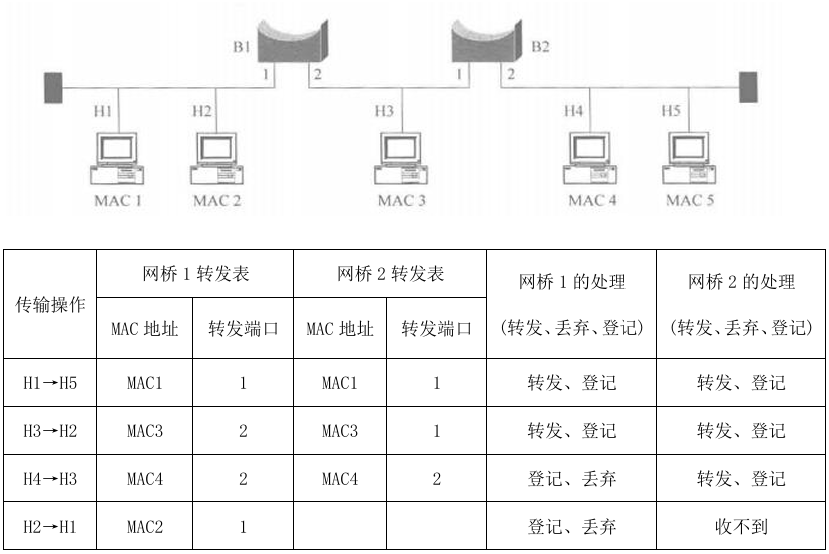

## 21. 根据图所示网络结构，假定所有交换机的初始转发表为空，给出完成终端A→终端B、终端E→终端F、终端C→终端A数据帧传输后各个交换机中转发表的内容。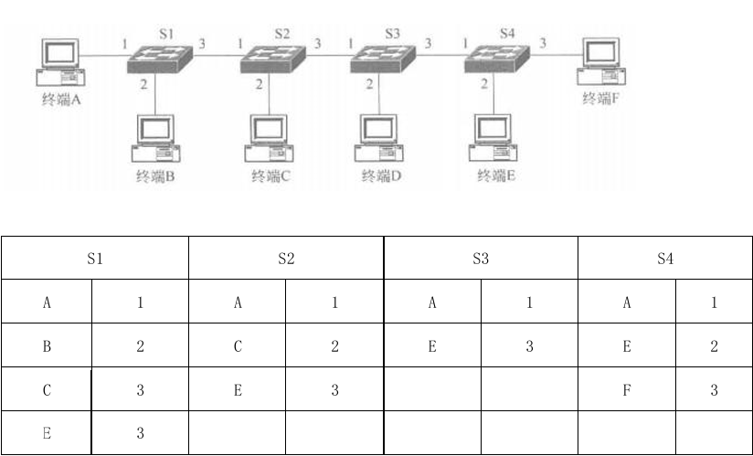

## 22. 为什么要划分VLAN? 802.1Q有什么作用?连接终端的交换机端口是否只能是非标记端口?为什么?
1. 增加广播域的数量，缩小广播域范围，降低广播危害，提升网络整体性能。
2. 802.1Q 是 VLAN 干道协议，它负责给通过交换机共享端口发出的帧打一个VLAN标记，用于标识该帧属于哪个VLAN。
3. 不一定。因为共享端口需要打标记，即为标记端口。连接终端的端口是不能打标记的，因为打了以后终端就不认识了。交换机上除了接入端口不打标记外，混合端口（可以标记也可不标记）也可以不打标记，也可以为终端做接入，但是并不是所有的交换机都有混合端口。

# 第六章

## 3. 作为互连设备，中继器、网桥和路由器有何区别?

- 中继器：工作在物理层，在转发数据时不对传输媒体进行检测，只是对数据分组进行简单的转发（逐比特转发），因此只能连接相同速率的网络。中继器不提供网络隔离，所有连接到中继器的设备都在同一网络段上。
- 网桥：工作在数据链路层，网桥能够识别MAC地址，并根据MAC地址表来决定是否转发帧。它可以过滤掉不必要的广播帧，能够连接不同速率的网络。可以在不同网络段之间提供一定程度的隔离，但它们仍然在一个局域网内。
- 路由器：工作在网络层，具有存储转发功能，可根据IP地址和其他路由信息来决定数据包的最佳路径，路由器适用于连接不同网络，能够处理不同网络之间的数据传输。路由器提供了不同网络之间的隔离，它们可以连接局域网和广域网，并提供安全和访问控制功能。

## 4. 何为默认网关?终端配置默认网关地址的作用是什么?

- 默认网关是网络设备在无法找到特定目标网络时发送数据包的默认IP地址。
- 作用：
    - 路由选择：默认网关提供了一个出口，使得终端设备能够将数据发送到局域网以外的网络。当终端设备需要发送数据到互联网或其他远程网络时，它会将数据发送到默认网关。
    - 网络隔离：默认网关有助于隔离内部网络和外部网络，保护内部网络不受外部网络的直接访问，增强网络安全。
    - 地址转换：在一些配置中，如NAT（网络地址转换）环境中，默认网关可以为内部网络设备提供地址转换服务，使得多个设备能够共享一个公共IP地址访问互联网。
    - 简化配置：对于终端用户来说，只需要知道默认网关的地址，而不需要了解复杂的网络结构和路由细节，这简化了网络配置和维护工作。

## 8. 简述IP地址和MAC地址之间的区别，以及各自的作用。

- 区别：
    - IP地址为网络层地址，MAC地址为数据链路层地址；
    - IP地址用于全球互联网的设备标识和路由，而MAC地址仅在同一局域网内有效；
    - IP地址可以动态分配，而MAC地址是固定的；
    - IP地址在同一网络内唯一，但在全球范围内可以重复（不同网络可以有相同的IP地址），MAC地址全球唯一；
    - IP地址可以手动配置或通过自动配置获得，而MAC地址不可更改。
- IP作用：
    - 网络间通信：IP地址允许设备在不同的网络之间进行通信。每个连接到互联网的设备都有一个唯一的IP地址，用于标识设备的位置。
    - 路由选择：IP地址使得数据包能够在复杂的网络环境中找到正确的路径从源头到达目的地。
    - 网络标识：IP地址标识了设备所在的网络。在IP地址中，一部分表示网络ID，另一部分表示主机ID。
    - 寻址和识别：IP地址用于在网络上寻址和识别特定的设备。
- MAC地址的作用：
    - 局域网内通信：MAC地址用于同一局域网（LAN）内设备之间的通信。它是数据链路层的地址，用于以太网帧的传输。
    - 物理地址识别：MAC地址作为物理地址，用于在局域网内直接识别和寻址网络设备。
    - 数据链路层操作：在数据链路层，交换机和桥接器等设备使用MAC地址来转发帧。

## 9. 为什么需要无分类编址?它对路由项聚合和子网划分带来什么好处?

- 原因：
    - 单播IP地址分为A.B.C三类，每一类IP地址中网络号和主机号的位数是固定的，导致IP地址浪费严重，路由项增多和C类网络地址使用率较低等问题。
- 好处：
    - 消除地址分类：CIDR消除了传统的A类、B类和C类地址的分类概念，以及划分子网的概念，使得IP地址的分配更加灵活和高效。
    - 提高IP地址利用率：通过使用可变长度的子网掩码，CIDR允许网络管理员根据实际需求自由划分和分配IP地址，减少了IP地址的浪费。
    - 路由聚合（构造超网）：CIDR使得可以将具有相同网络前缀的连续IP地址组成一个“CIDR地址块”，这有助于路由聚合，减少了路由表的大小，简化了路由选择过程。
    - 简化子网划分：CIDR将子网地址与子网掩码融合，使得子网划分更加容易和直观。
    - 最长前缀匹配：在CIDR中，路由器在查找路由表时会选择网络前缀最长的路由，这称为最长前缀匹配，因为这样的路由更具体，从而提高了路由选择的精确性。
    - 便于维护和管理：CIDR的引入使得网络的组织更加灵活，更便于维护和管理。
    - 路由表优化：CIDR通过减少路由表中的条目数量，优化了路由表的结构，使得路由更加高效。
    - 适应不同规模网络的需求：CIDR可以根据客户的需要分配适当大小的CIDR地址块，从而更加有效地分配IPv4的地址空间。

## 10. 什么是最长前缀匹配算法?在什么条件下需要使用最长前缀匹配算法?

- 当路由器收到一个IP数据包时，它会将数据包的目的IP地址与本地路由表中的所有路由表项进行逐位比对，直到找到匹配长度最长的条目，这就是最长前缀匹配算法。
- 条件：
    - CIDR的采用使路由表条目的前缀长度可以任意变化。
    - 当路由表中有多个可用路由时，最长前缀匹配可以确定那个路由更为具体。
    - 优化搜索次数，提高路由效率，提升路由选择的准确性。

## 14. 一个 3200b的TCP报文传到IP层，加上160b的首部后成为IP分组。下面的互连网由两个局域网通过路由器连接起来，但第2个局域网所能传送的最长数据帧中的数据部分只有1200b，因此IP分组必须在路由器中进行分片，试问第2个局域网实际需要为上层传输多少位（b）数据?

3200+160=3380 

1片 160+1200；2片 160+1200；3片 160+800

## 15. 假定传输层将包含20字节首部和2048字节数据的TCP报文递交给IP层，源终端至目的终端传输路径需要经过两个网络，其中第一个网络的MTU是1024字节，第二个网络的MTU是512字节，IP首部是20字节，给出到达目的终端时分片后的IP分组序列，并计算出每一片的净荷字节数和片偏移。

TCP 报文长度等于 2048 + 20 = 2068字节

1. 经过第一个网络 MTU=1024，数据部分最大长度1004，但 1004不能8整除，所以取1000长度。
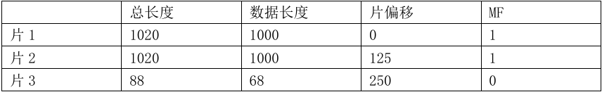
2. 经过第一个网络 MTU=512，数据部分最大长度492，但492不能8整除，所以取488长度。
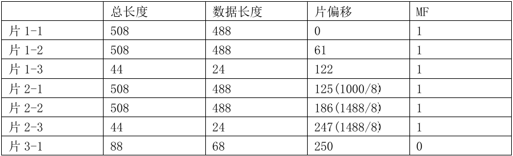

## 19. 如果重新设计IP地址时，将IP地址设计为48位，能否通过IP地址和MAC地址之间的一一对应关系消除ARP地址解析过程?

## 20. 设某路由器建立了如下路由表（这三列分别是目的网络、子网掩码和下一跳路由器，若直接交付，则最后一列给出转发接口）∶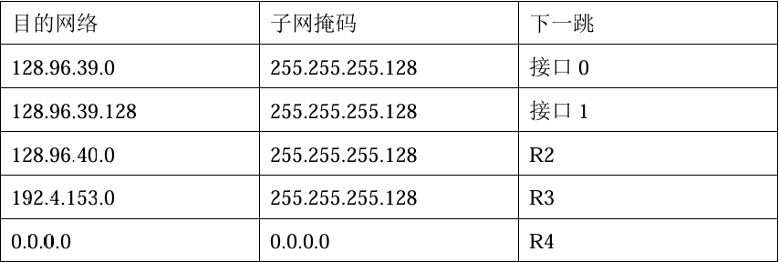现收到5个IP分组，其目的IP地址如下，试分别计算出下一跳路由器或转发接口。

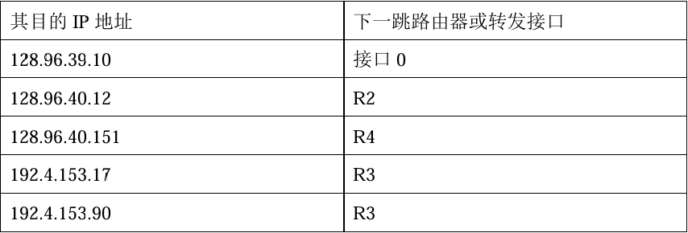

## 21. 某单位分配到一个B类网络地址124.250.0，假定该单位有4000多台机器，分布在16个不同的地点。如果选用的子网掩码为255.255.255.0，给每个地点分配一个子网号，并根据子网号计算出每个地点可分配的IP地址范围。

## 22. 一个IP分组的数据字段长度为4000字节（固定长度首部），需要经过一个MTU为1500字节的网络，计算出数据片数量，封装每一个数据片产生的IP分组首部中片偏移字段和 MF标志的值。

分片后的IP数据报固定首部长度为20字节，数据部分最大可以为1480字节。最佳切片位置，要能被8整除并且首部+数据部分长度小于等于1500字节的最大值处。 
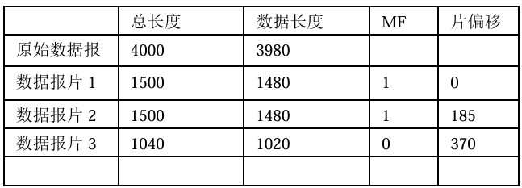

## 23. IP 分组中的首部检验和只检验IP分组首部，这样做的好处是什么?坏处是什么?IP分组首部检错码为什么不采用CRC?

好处：首部语法字段取值多变，字段值意义重大，因此需要检测。只对首部的好处是为减少检测范围，但也包括了多变的且重要的部分，能提高检测效率。

坏处：数据部分的出错无法检测。
不采用CRC是因为在数据链路层已经用CRC检测过了，它的可靠性很高，因此计算开销也大，综合考量，没有必要重复使用高强度的检测。

## 26. 根据图所示的网络地址配置，给出路由器R1、R2和R3的路由表。如果要求路由器R2中的路由项最少，如何调整网络地址配置，并根据调整后的网络地址配置，给出路由器R1、R2 和R3的路由表。
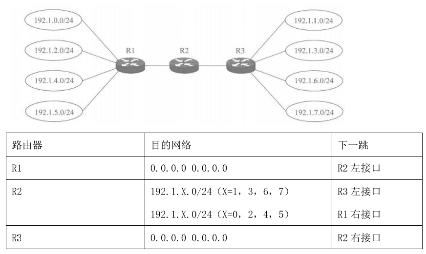

调整如下：192.1.X.0/24（X=0，1，2，3）分配在左边；其余在右边 
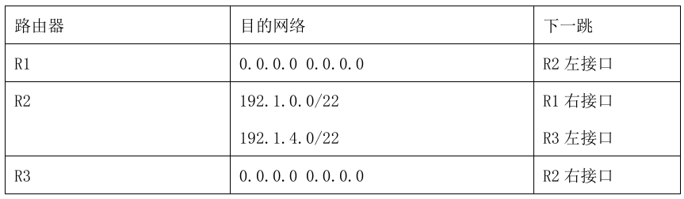

## 27. 根据图所示的互连网络结构，假定分配的CIDR地址块为192.1.0.0/24，图中每一个局域网旁边标明的数字是该局域网的主机数。请为每一个局域网分配合适的网络地址，分配时要考虑：1.地址要节约使用，2.要方便进行路由聚合。给出你认为可行的分配方案。

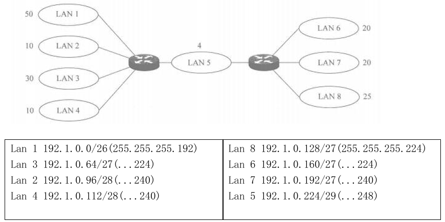

# 第八章

## 2. UDP 报文和IP分组有何差别?为什么需要UDP?

## 3. 简述UDP适用于传输多媒体数据的原因。

## 4. TCP/IP 体系结构为什么把差错控制和拥塞控制放在传输层?

## 9. 重传定时器溢出和连续接收到3个重复的确认应答是发现TCP报文丢失的两种依据，它们之间有什么区别?为什么会对拥塞控制机制产生影响? 

## 10. TCP 连接刚建立时采用慢启动机制发送TCP报文的理由是什么?为什么重传定时器溢出也需要采用慢启动机制来降低发送流量?为什么两种慢启动过程需要设置不同的慢启动阈值? 

## 13. TCP连接的本质含义是什么?为什么存在TCP连接建立过程?

## 18. TCP 拥塞窗口与发送轮次n的关系如表所示。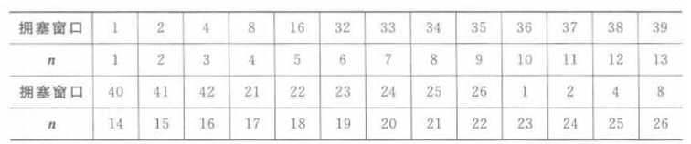

### 1. 指出属于慢启动过程的轮次。

### 2. 指出属于拥塞避免过程的轮次。

### 3. 指出确定TCP报文丢失的轮次及依据。

### 4. 第几轮次发送第70个TCP报文。

## 拥塞控制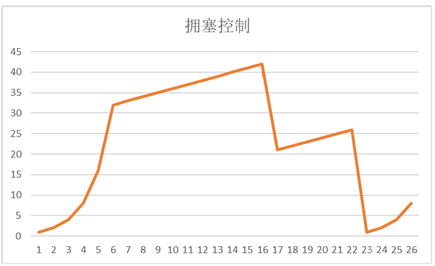

### 1. 画出拥塞窗口变化过程

### 2. 指出属于慢启动过程的轮次。

1-6, 23-26

### 3. 指出属于拥塞避免过程的轮次。

7-16, 17-22 

### 4. 指出确定TCP报文丢失的轮次及依据。

第16（收到3个重复确认应答）

22轮（启动超时重传）

### 5. 第几轮次发送第70个TCP报文。

第7轮次

## 26. 终端 A向终端B连续发送两个序号分别为70和100的TCP报文，请做下列计算

### 1. 求第一个TCP报文的数据字段长度。

30字节（70-99）

### 2. 求终端B对应第一个TCP报文的确认序号。

100

### 3. 如果终端B对应第二个TCP报文的确认序号为180，求第二个TCP报文的数据字段长度。

80字节（100-179）

### 4. 如果第一个TCP报文丢失，第二个TCP报文到达终端B，求终端B对应第二个TCP报文的确认序号。 

70

## 28. 用户用浏览器访问Web服务器时，感到很慢，从TCP工作机制着手分析，可能有哪些情况 

- Web 服务器有高并发、压力大，因此能为每个连接分配的缓存资源不足，导致TCP接收窗口变小，限制了用户端的发送节奏。

- 网络拥塞，用户端和服务器端感知到网络拥塞，主动降低拥塞窗口，大幅减少向网络注入TCP报文的数量，导致传输时延增加。

# 第九章

## 1. 简述C/S结构与P2P结构的特点。

## 3. 域名系统的功能是什么?如何实现域名到IP地址的转换? 

## 4. 什么是完全合格的域名?为什么只有完全合格的域名才能转换成IP地址? 

## 6. 简述浏览器访问某个Web服务器主页的过程。 

## 7. 浏览器访问URL指定的资源的过程中使用哪些应用层和传输层协议?
